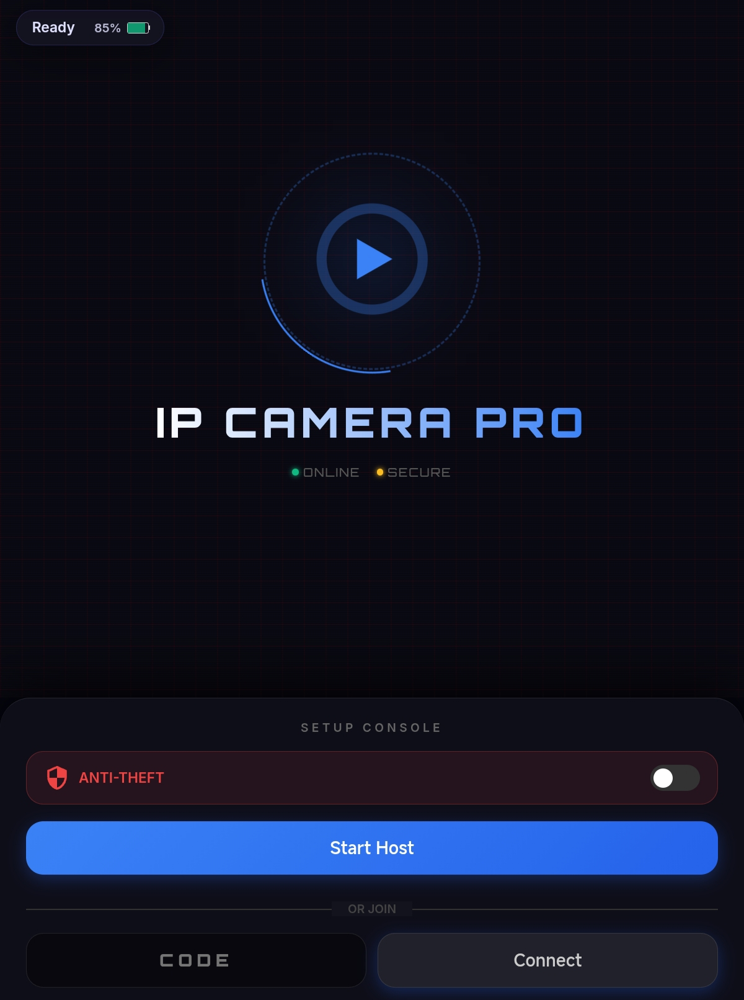
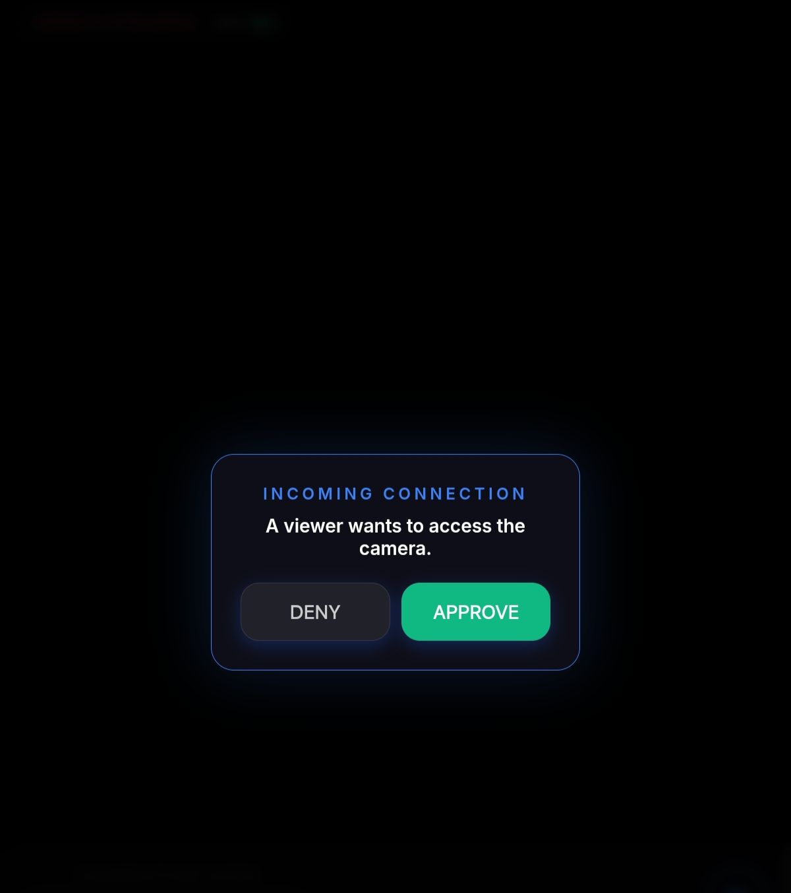
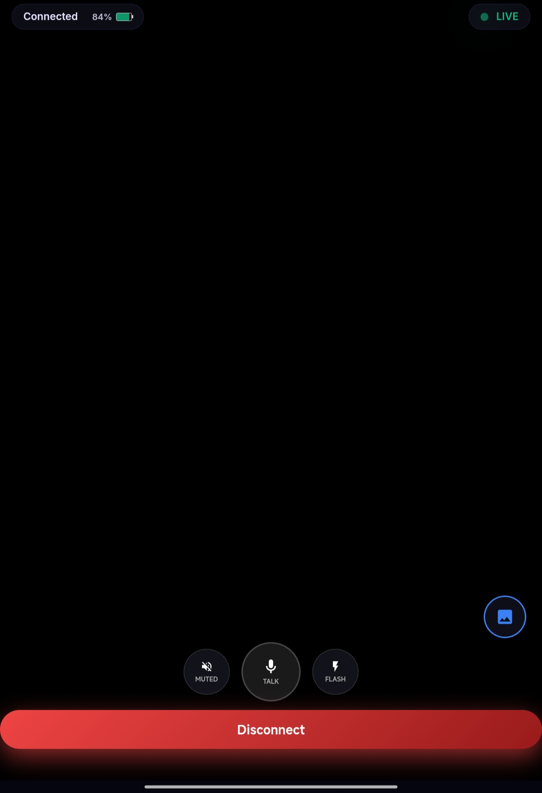

<div align="center">

  
  <br />
  <br />

  <h1>🔒 IP Camera Pro</h1>
  
  <p>
    <strong>Turn any device into a secure, AI-enhanced surveillance camera with remote control.</strong>
  </p>

  <p>
    
    
    <a href="https://github.com/shubhambelbase/IP_Camera_Pro/stargazers">
      
    </a>
  </p>

  <h3>
    <a href="https://shubhambelbase.github.io/IP_Camera_Pro/">🔴 View Live Demo</a>
  </h3>
</div>

---

## ⚡ The Vibe

This isn't just a camera app; it's a **pocket security system**. Vibe coded to feel like a sci-fi gadget, it uses a cyberpunk interface to deliver real-world utility.

Built entirely in the flow state, it pushes the limits of what a web browser can do—handling video streams, motion detection, and peer-to-peer data syncing without a single backend server.

## 💡 What It Does

**IP Camera Pro** establishes a secure, direct connection between two devices (Host & Viewer).

* **The Problem:** Traditional IP cameras are expensive, require apps, and upload your footage to questionable clouds.
* **The Solution:** A browser-based tool that uses the device you already own. Your data streams directly between devices. **Privacy by design.**

## 📸 Screenshots

| Host Screen | Approval | Viewer Screen |
|:---:|:---:|:---:|
|  |  |  |

## ✨ Key Features

| 🛡️ **Security & Monitoring** | 🎮 **Remote Control** |
| :--- | :--- |
| **Motion Guard:** Detects movement & auto-saves evidence | **Remote Flash:** Toggle the host flashlight remotely |
| **Connection Approval:** You decide who connects | **2-Way Audio:** Talk back via the viewer device |
| **Incident Gallery:** Motion logs saved to IndexedDB | **Digital Zoom:** 5x remote zoom capability |
| **Night Vision:** Software-enhanced low-light filter | **Battery Monitor:** Live battery tracking of host |

## 🛠️ Built With

* **WebRTC (PeerJS):** For low-latency, encrypted P2P streaming.
* **HTML5 Media API:** For accessing camera, microphone, and torch.
* **IndexedDB:** For storing motion detection logs locally in the browser.
* **Vanilla JS:** Zero framework bloat for maximum performance on old devices.

## 🚀 How to Run

Because this app requires camera and microphone permissions, **it must be run via HTTPS** or `localhost`.

### Option 1: GitHub Pages (Easiest)
1.  Fork this repo.
2.  Enable **GitHub Pages** in your repo settings.
3.  Open the link on two devices (one as **Host**, one as **Viewer**).

### Option 2: Local Network
1.  **Clone the repo:**
    ```bash
    git clone [https://github.com/shubhambelbase/SelfhostIpwebcam.git](https://github.com/shubhambelbase/SelfhostIpwebcam.git)
    ```
2.  **Navigate to folder:**
    ```bash
    cd SelfhostIpwebcam
    ```
3.  **Run with a secure server:**
    (VS Code "Live Server" works great, or use Python)
    ```bash
    # If using Python 3
    python -m http.server 8000
    ```
    *Note: To access on a different device on your WiFi, you might need an HTTPS tunnel (like `ngrok`) because browsers block camera access on insecure HTTP connections.*

## 📖 How to Use

1.  **Host Mode (Old Phone/Laptop):**
    * Open the app and click **"Start Camera Host"**.
    * (Optional) Enable **"Motion Guard"** to auto-record movement.
    * Share the **4-digit Connection Code**.

2.  **Viewer Mode (Your Daily Phone):**
    * Enter the 4-digit code in the "Remote Access" box.
    * Click **"Connect"**.
    * **Approve** the connection on the Host device.
    * You can now see the stream, talk back, and toggle the flashlight!

## 🤝 Contributing

Got an idea to make this even more "Cyberpunk"?
1.  Fork it.
2.  Create your Feature Branch (`git checkout -b feature/NightVisionV2`)
3.  Commit your Changes.
4.  Push to the Branch.
5.  Open a Pull Request.

---

<div align="center">
  <p>Vibe coded with ❤️ by <a href="https://github.com/shubhambelbase">Shubham Belbase</a></p>
</div>

